## ProxylessNAS: Direct Neural Architecture Search on Target Task and Hardware. 

[Han Cai](https://link.zhihu.com/?target=http%3A//han-cai.github.io/), [Ligeng Zhu](https://link.zhihu.com/?target=http%3A//lzhu.me/), [Song Han](https://link.zhihu.com/?target=http%3A//songhan.mit.edu/).

[[网站](https://link.zhihu.com/?target=https%3A//hanlab.mit.edu/projects/proxylessNAS/)] [[代码](https://link.zhihu.com/?target=https%3A//github.com/MIT-HAN-LAB/ProxylessNAS)] [[论文](https://link.zhihu.com/?target=https%3A//arxiv.org/abs/1812.00332)]

ref:  https://www.zhihu.com/question/296404213/answer/547163236

### Indroduction

######Neural Architecture Search (NAS): 

用学习算法去不断学习神经网络结构，以提高SOTA或者其他网络性能指标。

* First attempt: [**Zoph et al. 2017**](https://arxiv.org/abs/1611.01578), Neural Architecture Search with Reinforcement Learning

  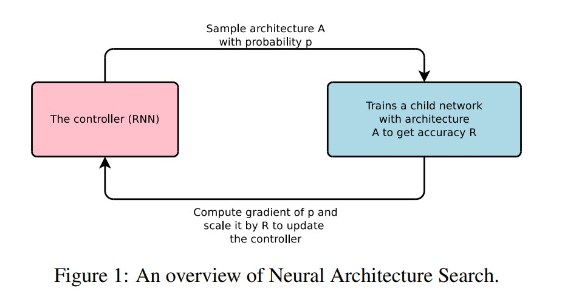

  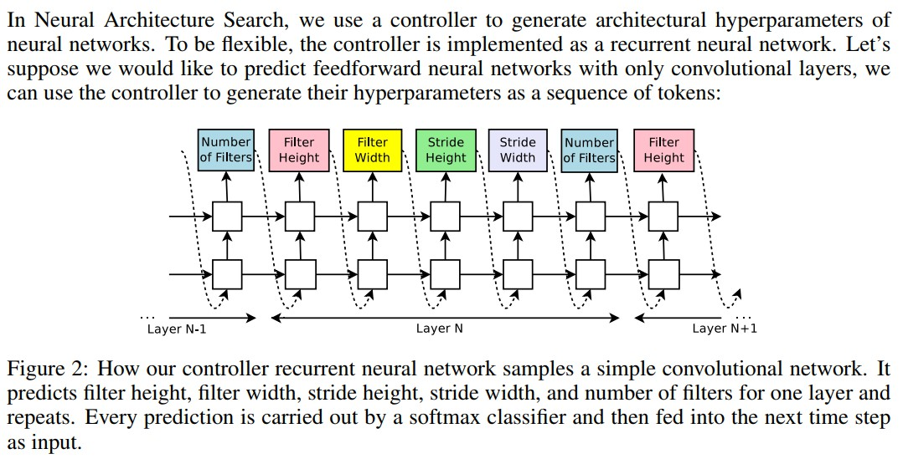

* Improvement： Zoph et al. ‎2017, [Learning Transferable Architectures for Scalable Image Recognition](https://arxiv.org/abs/1707.07012)

  To reduce cost: searching for building blocks on **proxy** tasks: 

  1. 先在小数据集（CIFAR）上搜索，然后迁移到大数据集（imagenet）。
  2. 先搜索一个比较浅的网络，然后重复堆叠同样的结构单元来得到更深的网络。
  3. 只做训练少量 epoch （e.g. 5 epoch），然后就 validate。

* Other method without controller: [DARTS: Differentiable Architecture Search](https://arxiv.org/abs/1806.09055), 

  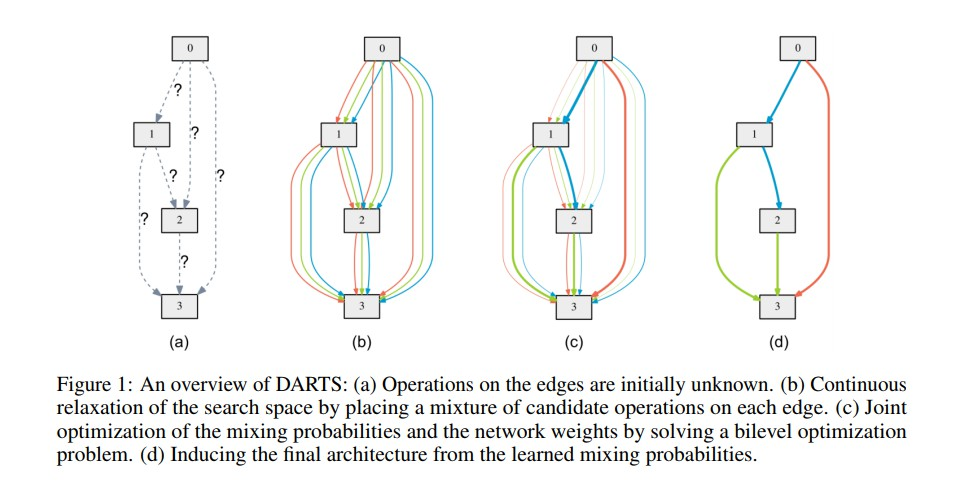

​          $$m_{\mathcal{O}}^{DARTS} (x) = \sum_{i=1}^{N}p_io_i(x) = \text{softmax}(\vec{\alpha}) \cdot o(\vec{x})$$

### Innovation

主要任务就是 **打破 proxy** ，**Proxyless** 地在 **Target Task** 上搜索一个 **Huge design space** 并 **Optimize for Target Hardware**.

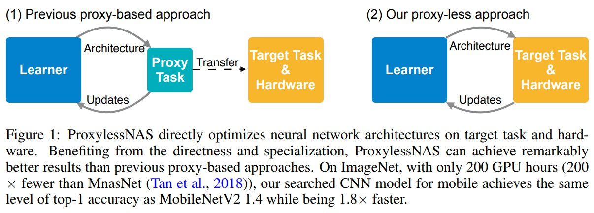

ProxylessNAS在DARTS等的基础上，进行改进，减少内存开销。把 NAS 当作一个 Path level pruning 问题，ProxylessNAS 的做法是先构建一个多路径的大网络，训练完后做 pruning 掉冗余的路径。这样就只要训练一个网络，GPU Hours 方面的消耗就不再是问题。

为了解决显存占用和 search candidates 线性增长的问题，我们将路径上的 arch parameter 二值化（参考了 BinaryConnect），在搜索时仅有一条路径处于激活状态。这样一来 GPU 显存就从 O(N) 降到了 O(1)。

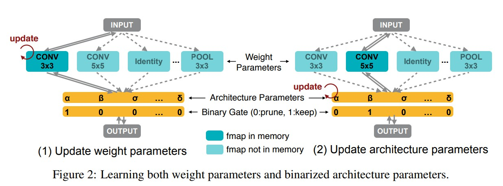

解决 direct on target task 以后，我们来处理 direct for target hardware。这篇工作中主要考虑的硬件指标是延迟 latency。我们通过 latency estimation model，将延迟建模为关于神经网络的连续函数，并提出了 Gradient 和 RL 两种方法在搜索过程对其优化。

### Method

对weight parms和arch parms交替更新。两个更新相互独立。

* weight parms 采用 GD update
* arch parms 更新讨论见下

###### Binarized Path

* Idea:

  为减少对over-parms net训练的内存开销，本文借鉴二值化网络（binary connect）的思想，将arch-parms依概率二值化，每次在训练weights的时候只保留一条通路的active：

  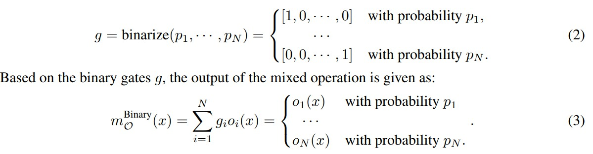

* Training Binarized Arch Parms：

  * General idea:用二值化近似$g$ 值近似$\alpha$:

    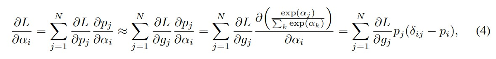

    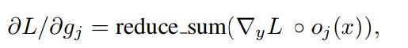

    正常更新每次的arch parms 仍然需要计算每一个path的output，这与最初的设想（降低计算开销）冲突。

  * **Trade-off**：每次arch parms 的更新只选择两个path的arch parms 进行更新：
    * 依多项分布$multinomial(p_i,\cdots,p_N)$ 选取两个path，此时$N=2$, 对$\alpha$ 的偏导的计算也有了相应的下降。
    * 依GD更新这两路的arch parms
    * 对除这两路的arch parms进行rescale， 使得其他arch parms对应的选择概率不因为局部arch parms更新而改变。

* Handling Non-Differentiable Hardware Metrics

  * Estimate Latency：延迟建模为关于神经网络的连续函数。

    建模特征：

    * type of the operator
    * input and output feature map size
    * other attributes like kernel size, stride for convolution and expansion ratio

    用4k个不同组合的NN在Pixel 1上的latency作为trainset

    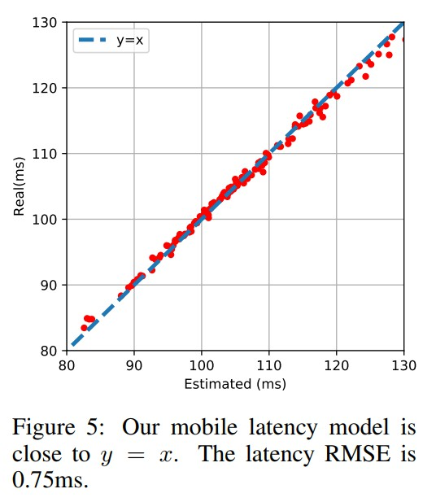

  * **Strategy 1**: Make Latency Differentiable:

    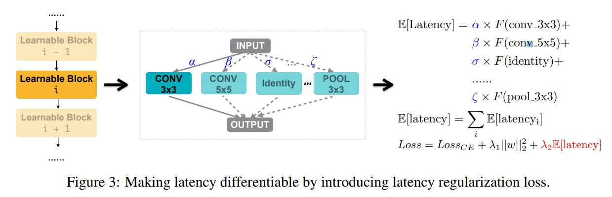

  * **Strategy 2**: REINFORCE-based approach

    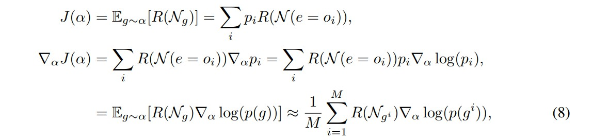

### Experiments:

在 CIFAR-10，ProxylessNAS 达到了新的 the state-of-the-art 2.08%。而且值得一提的是，对比之前的最好模型 AmoebaNet，我们模型仅用了 1/6 的参数就达到了更好的性能（5.7M v.s. 34.9M）。

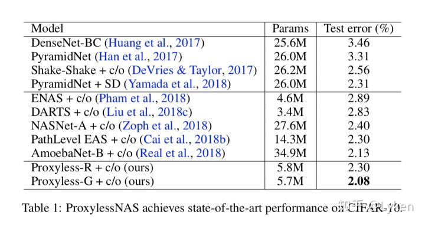

在 ImageNet 上，ProxylessNAS 在维持同等的 latency 的前提下，TOP-1准确率提升了 **2.6%**。此外，在各个 width setting下，我们的模型始终大幅优于 MobilenetV2：为了达到 74.6% 的精度，MobilenetV2 需要 143ms的 inference time，而我们模型仅需要 78ms（1.83x 倍）。与 MnasNet 相比，我们所消耗的搜索资源要得多 (1/200)，但模型却在提升 0.6% Top-1 的略微提升了速度。在 target GPU 时，ProxylessNAS 更是到了 75.1% 的 accuracy，且运行速度比 Mobilenet 快 20%

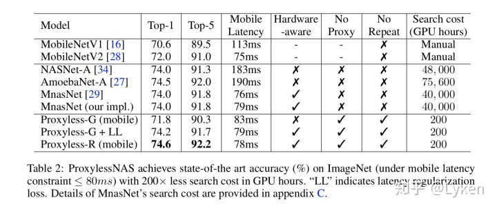

同时我们观察到一些有趣现象：针对GPU优化的模型在CPU和移动端上运行速度并不快，反之亦然。之前将一种 CNN deploy 到多个平台上的做法并不是最优的。 

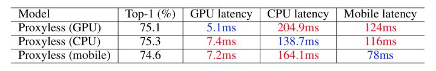

下图展示了三个硬件平台上搜索到的 CNN 结构：GPU / CPU / Mobile。总的来说，GPU 模型短而宽 ，CPU / Mobile 长而瘦，feature map downsample 时大家都喜欢 larger kernel / more channels 更多的操作。希望这个能给之后设计高效 CNN 带来一些灵感。

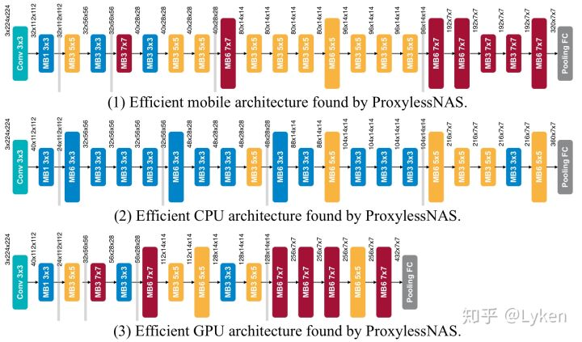

PS: 关于网络结构随着搜索变化的过程的一个可视化 [visualization.mp4](https://link.zhihu.com/?target=https%3A//hanlab.mit.edu/files/proxylessNAS/visualization.mp4)。
