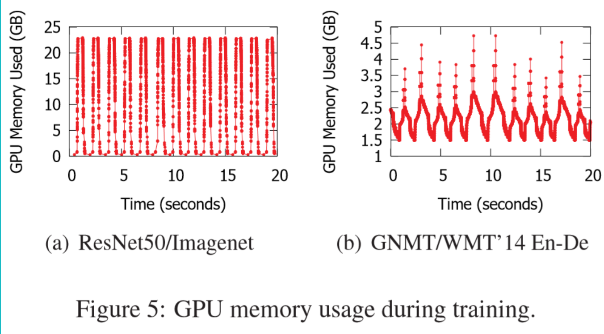
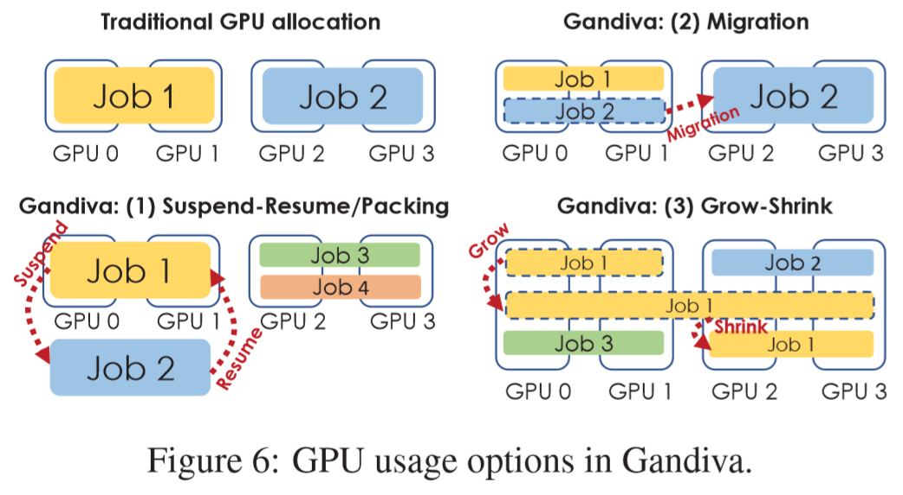
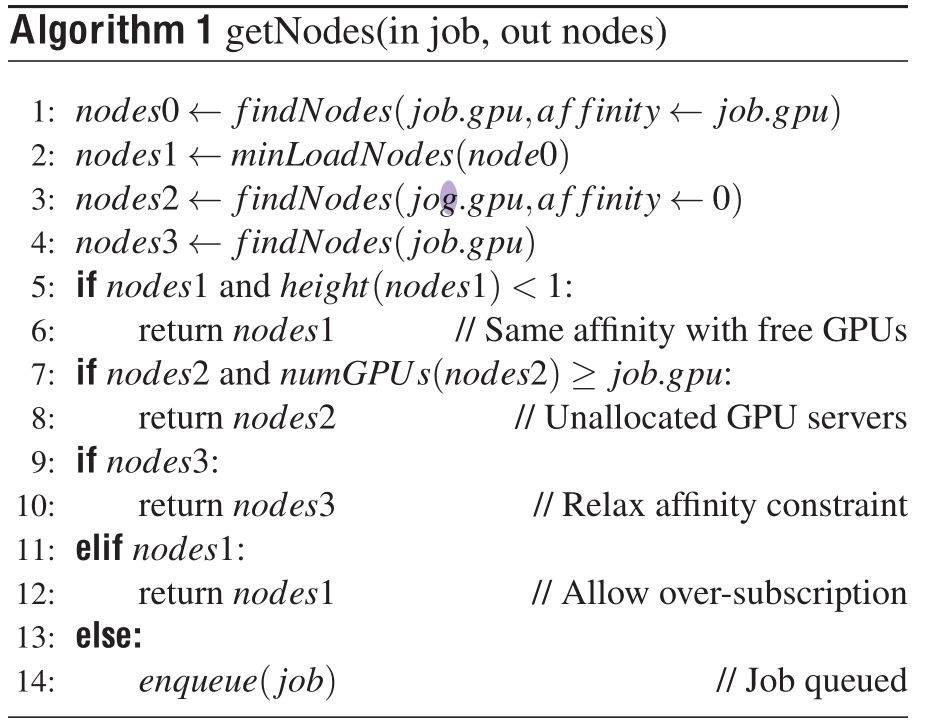

#Gandiva

*Gandiva: Introspective Cluster Scheduling  for Deep Learning*

## Key points

**Gandiva:** 

* a new cluster scheduling framework
* utilizes **domain-specific knowledge** to improve **latency and efficiency** of training deep learning models in a GPU cluster. 
* exploiting **intra-job predictability** of DL, as they perform numerous mini-batch iterations. 
  * low latency: to time-slice GPUs efficiently across multiple jobs
    * re-defines the atom of scheduling from a job to automatically partitioned micro-tasks. 
  * efficiency: to introspect job performance (mini-batch progress rate ) and dynamically migrating jobs to better-fit GPUs
    * packs multiple jobs on the same GPU only when they have low memory and GPU utilization
    * dynamically migrates a communication intensive job to more affinitized GPUs
    * opportunistically “grows” the degree of parallelism of a job to make use of spare resources, and shrinks the job when the spare resources go away

* APIs for DLT scheduling: co-design approach of Gandiva on both the scheduler layer and the DLT toolkit layer such as Tensorflow or PyTorch.
  * efficient suspend-resume or time slicing,  
  * low-latency migration, 
  * fine-grained profiling, 
  * dynamic intra-job elasticity,
  * dynamic prioritization

* implement an initial scheduling policy manager on top of Kubernetes and Docker containers 

* Mainly for the purpose of feedback-driven exploration/AutoML/NAS
  * uses early feedback on accuracy to dynamically prioritize or kill a subset of jobs

Result: 10x speed up for HPSearch. +26% utilization.

## Problem:

​	*All ~~men~~ schedulers make mistakes; only the wise learn from their mistakes.*

----

* the common practice today is to use a traditional cluster scheduler, such as **Kubernetes** or **YARN**, designed for handling big-data jobs such as MapReduce
  * a DLT job is treated simply as yet another big-data job that is allocated a set of GPUs at job startup and holds exclusive  access to its GPUs until completion.  
  * DLT require simultaneous early feedback on all jobs within the multi-job for early kill/stop.
  * the GPU RAM usage of a DLT job follows a cyclic pattern aligned with minibatch boundaries

## DLT Job Characteristics:

* **Sensitivity to locality**: certain multi-GPU DLT jobs may perform much better with affinitized GPUs,while other jobs may not be as sensitive to affinity. due to asymmetric architecture, different communication overhead.

  * in different CPU sockets (denoted as DiffSocket)
  * in the same CPU socket, but on different PCIe switches (denoted as SameSocket)
  * on the same PCIe switch (denoted as SamePCIeSw). 

* **Sensitivity to interference**

* **Intra-job predictability**: 

  

  exploited in Gandiva in multiple ways:

  * a DLT job can be automatically split into mini-batch iterations and a collection of these iterations over 60 seconds, say a **micro-task**, forms a **scheduling interval**
  * by performing the suspend operation at the minimum of the memory cycle, the amount of **memory to be copied from GPU** to be saved in CPU can be significantly reduced
  * the mini-batch progress rate can be profiled and used as **a proxy to evaluate the effectiveness** of applying mechanisms such as packing or migration.

## Design:

### Mechanisms:

1. during overload, instead of waiting for current jobs to depart, Gandiva allows incoming jobs to **time-share GPUs** with existing jobs

   * exploit this cyclic behavior and suspend-resume DLT jobs when their GPU memory usage is at their lowest
   * Suspend-resume may also initiate a change of GPU within the same server.

   **GPU Packing+Suspend-Resume **  

   * if jobs interfere, GPU self packing can be significantly worse than suspend-resume
   *  If two jobs are identified as candidates for packing, we pack them together and continue monitoring them.
   * If a given packing results in adverse impact on jobs’ performance, we unpack those jobs and revert to suspend-resume

2. supports efficient **migration** of DLT jobs from one set of GPUs to another. 

   * moving time-sliced jobs to vacated GPUs
   * migrating interfering jobs away from each other;
   * de-fragmentation of the cluster so that incoming jobs get GPUs with good locality

   ------

   two approaches for tackling DLT process state migration

   * leverage a generic process migration mechanism such as CRIU
     * checkpoint GPU objects and remove all GPU state from the process
       before CRIU is invoked
     * migration overhead is about 8-10s for single GPU jobs and higher for multi-GPU jobs (PyTorch)
   * the use of DLT jobs that are checkpoint-aware, eg Tensorflow API tensorflow.train.saver that allow automatic checkpoint and restore of models
     * warming up the destination before migration and only migrating the necessary training state
     * 1-2 sec overhead

   Either approach is worthwhile for the higher GPU utilization.

3. GPU **grow-shrink** mechanism so that idle GPUs can be used opportunistically

   * Gandiva applies this mechanism only to those DLT jobs that specifically declare that they are adaptive enough to take advantage of these growth opportunities 

Gandiva introspects DLT jobs by continuously profiling their resource usage and estimating their performance to support these mechanisms efficiently and enable effective resource management

**Profiling:**

unique in Gandiva: introspects DLT jobs in an application-aware manner to estimate their rate of progress

* estimates a DLT job’s mini batch time, the time to do one forward/backward pass over a batch of input data

### Scheduling Policy

DLT jobs are encapsulated in containers  and include 

​	the number of GPUs required, their priority and a flag indicating if the job is capable of grow-shrink

Cluster-level fairness is not a design goal in Gandiva

#### Terminology:

* height of **server**: $\lceil$M/N$\rceil$, where M: # allocated GPUs and N: # total GPUs.
  * the suspend/resume mechanism will only be used when the height of a server exceeds 1

* height of a **cluster**: the maximum height of all its servers
  * Overload occurs when the height of the cluster is greater than one
* affinity of a server: the type of jobs assigned to that server
  * Eg, initially servers have affinity of zero and, if a job that requires two GPUs is assigned to a server, the affinity of that server is changed to two.

#### 2 Modes:

* **reactive:**  when the scheduler reacts to events such as job arrivals, departures, machine failures.

  * **job placement:** 

    

  * over-subscription: When a server is over-subscribed, we do weighted round-robin scheduling to give each job its fair time-share

* **introspective**: a continuous process where the scheduler aims to improve cluster utilization and job completion time.

  * **Packing:**  a greedy heuristic to pack jobs
    * When jobs arrive, we always run them in exclusive mode using suspend-resume and collect profiling information
    * Based on the profiling data, the scheduler maintains a list of jobs sorted by their GPU utilization. 
    * The scheduler greedily picks the job with the lowest GPU utilization and attempts to pack it on a GPU with the lowest GPU utilization
  * **Migration:** use migration to improve locality whenever a job departs
    * pick jobs that are not co-located and try to find a new co-located placement
    * de-fragmentation,  pick the server with the most free GPUs among all non-idle ones. try to move the jobs running on that server to others.
  * **Grow-shrink**: only triggered when the cluster is under-utilized and the DLT jobs specifically identify themselves as amenable to grow-shrink
  * **Time-Slicing:**  support **round robin scheduling** in each server to time-share GPUs fairly

## Implementation:

DLT jobs are encapsulated as Docker containers containing our customized versions of DL toolkits and a Gandiva client. jobs are submitted to a Kuber-
netes system

### Scheduler:

* custom central scheduler and also a client component that is part of every DLT job container

* Kubernetes is responsible for overall cluster management, Gandiva scheduler manages the scheduling of DLT jobs

Modification to DL toolkit: see paper

## Concepts & Background:

* [ ] A GPU VM in the cloud costs nearly 10x that of a regular VM
* [ ] Kubernetes & YARN

- [ ] head-of-line-blocking
- [ ] run multiple DLT jobs on a GPU simultaneously and let the GPU time-share the jobs. We call this **packing**. Packing in GPU is efficient only when the packed jobs do not exceed the GPU resources (cores, memory) and do not adversely impact each other.  If jobs interfere, packing can be significantly worse than suspend-resume
- [ ] overhead of “paging” from CPU memory is significantly high [16]
- [ ] Ramdisk, NFS
- [ ] **MPS in V100 ?** 

## Related Paper/work

* CRIU [Checkpoint/restore in user space](https://criu.org/Main_Page)

  for process migration

**DLT Job scheduling:**

a fixed set of GPUs is assigned exclusively for the lifetime of a DLT job

* Scalable multi-framework multi-tenant lifecycle management of deep learning training jobs
* Multi-tenant GPU clusters for deep learning workloads: Analysis and implications

**Scheduling policies for machine learning**

* Topology-aware GPU scheduling for learning workloads in cloud environments

* Prophet: Precise QoS prediction on non-preemptive accelerators to improve utilization in warehouse-scale computers

* SLAQ: Quality-driven scheduling for distributed machine learning

  prioritizes resources in a CPU-based cluster to Spark jobs with high potentials

* Optimus: An efficient dynamic resource scheduler for deep learning clusters

  derives a proper number of parameter-servers and workers for MxNet-based deep learning jobs

