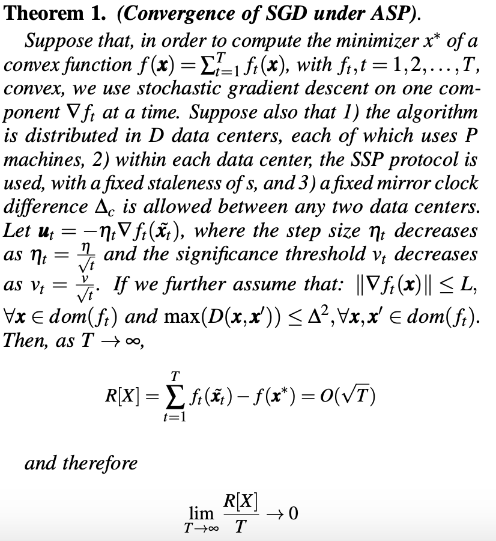

# Gaia: Geo-Distributed Machine Learning Approaching LAN Speeds

## Summary

* Problem:
  * Existing distributed ML systems do not consider the Geo-distributed settings. Privacy, Communciation, etc.
  * Communication over WAN is slow and costly.
  * New geo-distributed training method should be general and guarantee the model convergence. 
* Key Ideas
  * Decouple the synchronization model within the data center from the synchronization model between data centers
  * To reduce communication over WAN, only significant updates are broadcast  to different data centers.
  * To make sure the significant updates can be seen by all data centers in a timely fashion, selective barrier and mirror clock are used in ASP implementation.
* Key Contribution
  * The first work to propose a general geo-distributed ML system that decouple comm. over LAN and comm. over WANs. 
  * Propose a new, efficient ML synchronization model, Approximate Synchronous Parallel (ASP), for communication between parameter servers across data centers over WANs
  * build two prototypes of the proposed system on CPU-based and GPU-based ML systems. 
    * 1.8-53.5X speedup over state-of-the-art ML systems on WANs 
    * within 1.40X of LAN speeds

## Overview

**Overlay Network and Hub**: Communication overhead is proportional to the number of data centers; Save communication on WANs by aggregating the updates at hubs;

**Theorem for the model convergence under ASP**:

## Strength

* No change is required for ML algorithms and ML programs
* Mathetical proof of the correctness of the purposed ASP method
* Gaia can be used for a variety of SGD based ML algorithms. 

## Weakness

* Robustness of Gaia. What if the WAN is not reliable? -> Starvation / Dead lock
* The significance function & threshold. Not friendly to users who are not familiar with specific ML algorithm training.
* Imbalanced data distribution among different data centers:
  * Data from the same data center have similar features.
  * Variation of the size of the training data.

## Extensions and Directions for Future Work

* Current Trend: Federated Learning ("Towards Federated Learning at Scale: System Design", SysML'19)
* System level. 
  * Other ways to reduce the communication cost
    * Quantization of updated weights
    * Weight compression / sparsifying 
  * Communication Reordering for distributed DL training. ("Priority-Based Parameter Propagation for Distributed DNN Training", SysML'19; "A Generic Communication Scheduler for Distributed DNN Training Acceleration", SOSP'19)
  * Fault-tolerance & Recovering
* Algorithm level. 
  * More aggressive distributed parallelism policy. ("[Distributed Learning over Unreliable Networks](https://arxiv.org/abs/1810.07766)", ICML'19)
  * Data security & protection. ("Deep Leakage from Gradients", NeurIPS'19)

## My Comment

This paper is really the pioneer in the field of distributed ML system and asynchronous SGD. Back in 2017, the authors can foresee the potential problems for training ML models by using the data distributed across the world. Geo-distributed ML, federated learning and decentralized learning are still the popular research topics nowadays. People care more about the data privacy, generalized & personalized models, low latency on edge devices, etc.

The charming part for the ML system research is that optimization relies on our understanding of both complicated ML algorithms and various system/architecture designs. This paper not only proposes a efficient training system, but also provide new parallelism method with formal mathematical proof to guarantee the correctness.

The experiment methodology in this paper is also worth learning. The Gaia is first implemented on real AWS EC2, then on a local cluster with constrained bandwidth and performance. In this way, the reliability of the experiment is guaranteed, the monetary temporal cost of the experiment can be significantly reduced. 