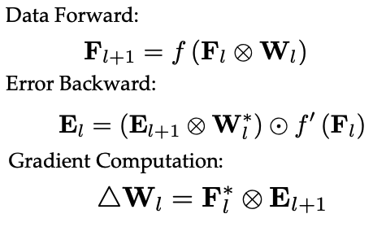
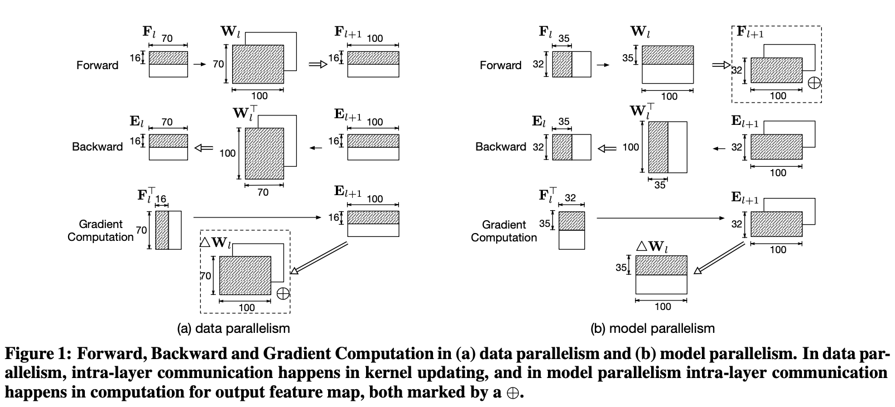
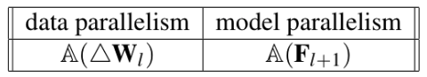
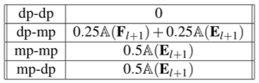
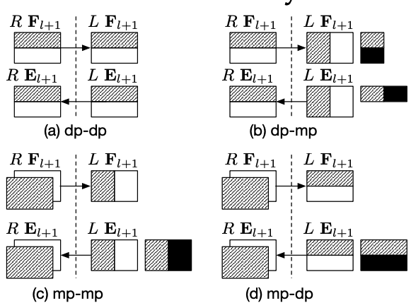
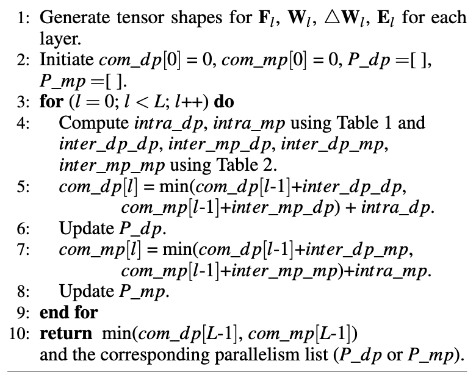
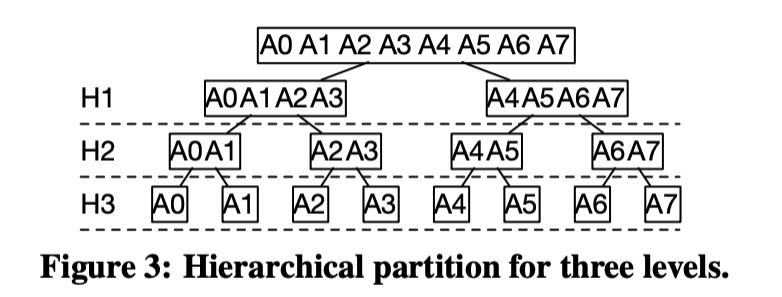
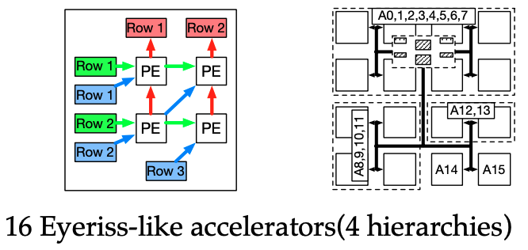
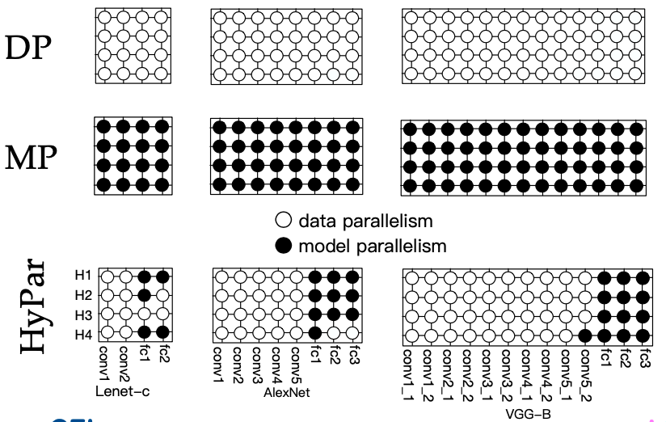

# HyPar: Towards Hybrid Parallelism for Deep Learning Accelerator Array

## Summary

* Topics: Deep learning accelerator, Parallelism of DL training, Distributed DL
* Problems:
  * Large DNN models and datasets, which incur frequent off-chip memory accesses for accelerators.  
  * Existing accelerator designs focus on fine-grain optimization/acceleration for DNN inference. Lack of studies on  model training on accelerators.
  * How to take advantage of a array of accelerators to train a large DNN model. Data parallelism or Model parallelism? Communication overhead.
  * Intra-layer parallelism is good enough (e.g. optimization for conv layer). How about inter-layer parallelism?
* Key Ideas: 
  * Give special consideration on the communication inside DNN training on multiple accelerators. 
  * Via mathematical analysis, model the communication overhead of different parallelism methods.
  * Using dynamic programming to find the combination of parallelism methods with minimized communication overhead.
* Key Contribution
  * Give a mathematic explanation on why data parallelism is more popular in todays' distributed DNN training framework.
  * Propose a practical way to do distributed DNN training on an array of accelerators with optimal communication overhead.
  * Build an array of HMC-based accelerators which take use of HyPar.

## Overview

**Two Types of Parallelism:**

**Comunication & Amount**

**Layer Partition**

* 2 accelerators:  layer-wise dynamic programming

  

* multiple accelerators: hierarchical partition

  * view the two accelerators as two groups of accelerators, dynamic programming can be used to parti- tion between two groups.

  

**Evaluation:**

**Results:**

Better performance; High energy efficiency; Less total communication; Better Scalability;

## Strength

* Straightforward and systematical problem analysis.
* Wisely use dynamic programming to find omptimal partitioning for 2 accelerators, and develop reasonable heuristic for multiple accelerators.
* The paper gives special consideration of algorithm-hardware system co-design.
* Solid and effective evaluation experiments.

## Weakness

* The testing models are all CNNs without any complicated DAG structure. 
* All HyPar is considered in a layer-to-layer way, but this method may not applicable for modern SOTA CNN models. They may have multi-branches or skip forwarding connections, which requires more consideration and modification of original algorithm/method.

## Extensions and Directions for Future Work

* Try to make such hybrid parallelism method applicable for more complex DNN models (e.g. ResNet, Inception Net and BERT)
  * layer-to-layer to block-to-block.
* Not only for DNN training on multiple accelerators, HyPar is also helpful for distributed training on GPU, CPU and edge devices.

  ## Comment

One of my favorite papers in 2019. This paper has a clear goal, which is to find a good parallelism method to optimize the communication for DNN training on an array of accelerators. The paper first analyzes the source of communication of two wide-used parallelism methods, data parallelism and model parallelism. After knowing where the communications come from, the paper starts to design algorithms to minimize the total communication. They start with simple case (2 accelerators), then extend their proposed algorithm to multiple accelerators. Finally, they build a real system to do the evaluation. 

From my personal point of view, this paper shows a typical procedure of conducting successful research. We first have a goal for the research, and then we do the thorough study of the problems. After that we try to come up with our own ideas to solve the problems from the simple cases gradually to the complex cases.

The idea inside this paper is not that hard to understand, but it is really hard to go one step further to find such problems and clearly present the ideas into a 10-page paper.