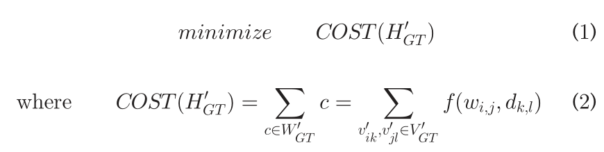
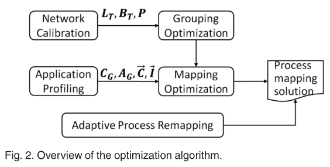
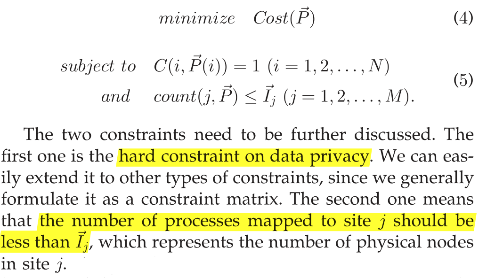
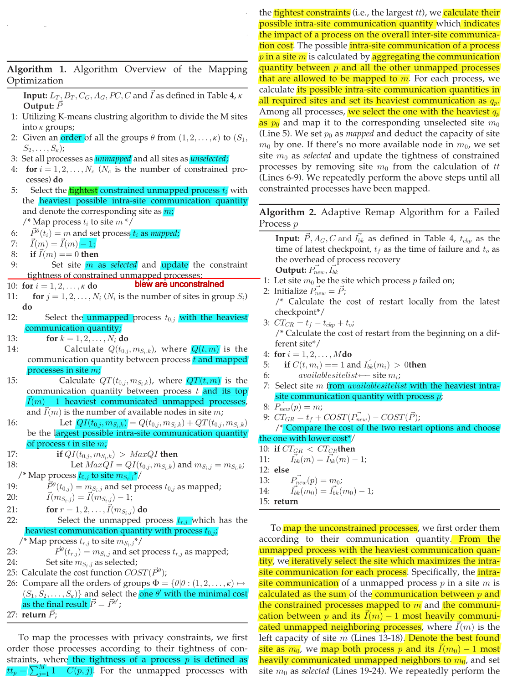

# Privacy Regulation Aware Process Mapping in Geo-Distributed Cloud Data Centers

## Problems

* the geo-distributed process mapping problem is non-trivial
  * different data privacy requirements in geo-distributed data centers pose additional constraints on the geo-distributed process mapping problem
  * network bandwidth in the geo-distributed cloud environment is highly heterogeneous
  * the large system scale, system failures caused by hardware/software reasons in geo-distributed environment have become the norm rather than the exception

## Problem Formulation

* **communication pattern**: is represented by utilizing a weighted directed graph $G = (V_G,E_G)$

  * V is set of processes
  * E is set of edges which represents the communications between any two vertexes

* **the (physical) interconnection performance**: is modeled by a weighted directed graph $T= (M_T, D_T)$

  * M is a set of machine nodes or processors
  * D is a set of network performance (e.g., latency or bandwidth) between any two vertices

* The definition of graph mapping from G to T is denoted as a mapping graph $H^{'}_{GT}=<V^{'}_{GT},E^{'}_{GT}>$

  * V' is a set of processes after being mapped to the set of machine nodes or processors
  * E' is the set of edges after being mapped

* The **optimization goal** of graph mapping is to minimize the real communication cost via intelligent mapping of the communication pattern graph to the interconnection network graph.

  

* define a constraint vector for each process to specify which data centers the process can be mapped to

* to utilize inter/intra-site performance model to obtain the interconnection network graph:

  * α-β model to calculate the communication cost. 

  

  **P**: is an N-dimensional vector, to represent the mapping graph function $H'_{GT}$ . The ith element of P represents the site number that process i has been mapped to

  **I**: is an M-dimensional vector, where the ith element represents the number of physical nodes in site i.

  **C**: is a N x M matrix, where each element Cij represents whether process i can be mapped to data center j (Cij=1) or not (Cij=0).

  **count(m, n)**:  counts the number of elements in n with value equaling to m

  

  

## Concepts

* **process mapping problem**: decides how to map parallel processes to processors (or nodes) such that the application communication topology efficiently utilizes the physical links.