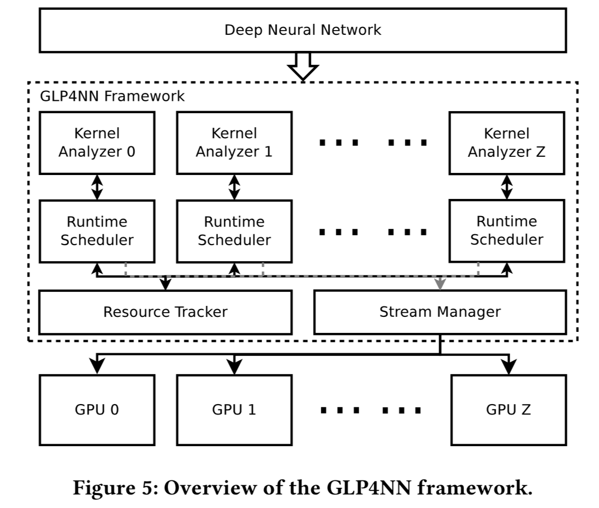
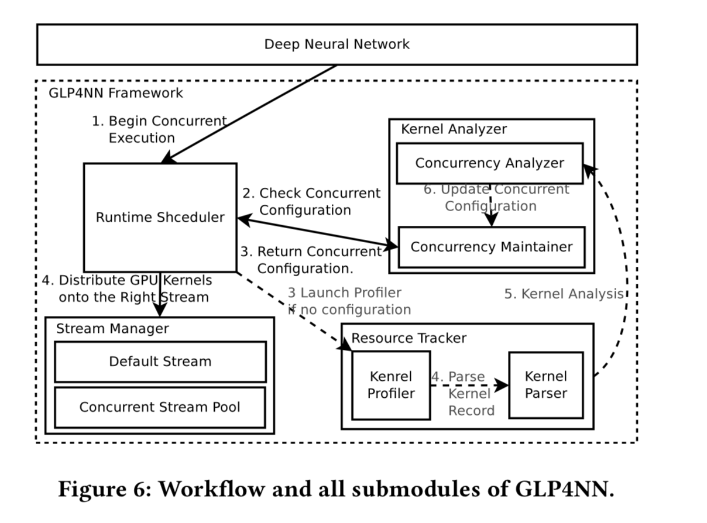
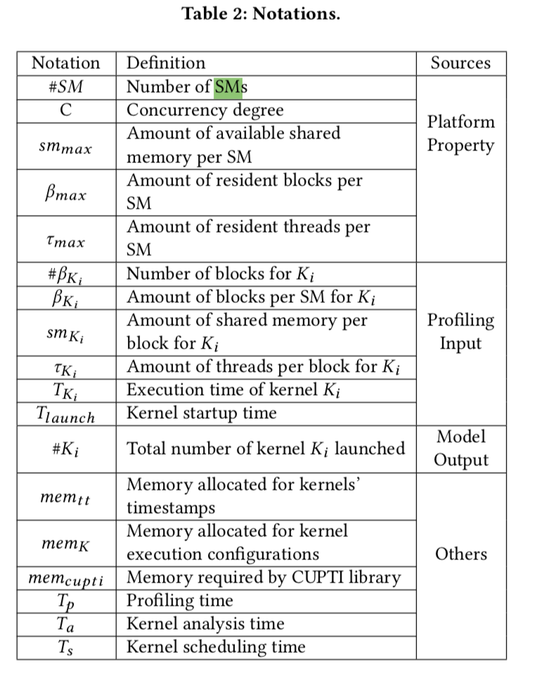

# GLP4NN

*Convergence-invariant and Network-agnostic Light-Weight Parallelization Framework for DNN on Modern GPUs*

**Result:** X4 speedup 

**Key points:**

* take advantage of **concurrent kernel execution**; to determine # concurrent kernel(CK) on the fly 
  * design an **analytical model** in the kernel analyzer module
  * integrate a **compact asynchronous resource tracker** in the resource tracker module by CUPTI
    * collecting runtime configurations of kernels with low memory and time overheads
* To avoid consuming too many CPU threads or processes while dispatching workloads to GPU devices:
  * further develop a **runtime scheduler module**
  * a **pool-based stream manager** for handling GPU work queues in GLP4NN instead of using multi-thread technology

**Problem & Challenges:**

* 3 challenges in the training phase of DNNs 
  * the collection of kernel execution configurations on-the-fly
    * nvvp, vampir: not good:
      * offline profiling: need sample execution
      * difficult to distinguish kernels belonging to different layers  with offline tools
  * how many concurrent kernels on different devices should be launched
    * how to launch kernels in parallel:
      * Hyper-Q and MPS features: occupy too many CPU threads or processes when many kernels should be launched concurrently
    * setting of the proper number of concurrent kernels
      * difference in GPU devices makes it impossible to specify a predefined optimal number of concurrent kernels for all
  * the guarantee of the convergence property of neural networks

**Main Work**

* **Resource Tracker:**  for collecting and maintaining kernel execution information at runtime. 

  * a self-defined compact profiler based on NVIDIA CUPTI library, called *kernel profiler*, is integrated into the proposed framework instead of utilizing existing profiling tools
  * kernel information collected will be passed to and parsed by the *kernel parser*

* **Kernel Analyzer:**  analyze the execution configurations of kernels to get the proper number of concurrent kernels

  * concurrency analyzer: responsible for kernel analysis
  * concurrency maintainer: to manage analysis results relative to a specific GPU.

  invoked by the *runtime scheduler* when the kernel profiling is finished, and its output is utilized to initialize the stream pool for launching kernels.

* **Stream Manager:** 

  * to support concurrent kernel execution without consuming too many system thread or process resources on the host side.
  * to maintain all concurrent streams on the current device
  * the default CUDA stream is utilized to perform synchronization operation based on the scheduling algorithm.

* **Runtime Scheduler:** in charge of

  * invoking the asynchronous resource tracker
  * obtaining the concurrency configuration from the kernel analyzer to initialize the corresponding stream pool in the stream manager module. 
  * dispatching kernels to GPU streams.

  take a round-robin scheduling policy for simplicity.

Workflow:

-------

* **Analytical Model**: to maximize the occupancy ratio ($OR_{SM}$) of GPUs, which is defined as the ratio of active warps on a SM (ωactive) to the maximum number of active SM warps supported by a SM (ωSM):

  

  $\begin{align}\max\quad OR_{SM} = \frac{\omega_{SM}^{active}}{\omega_{SM}}\\\Rightarrow \max\ \omega_{SM}^{active} = \frac{\tau_{total}}{\theta}\\\Rightarrow \max\ \tau_{total}=\sum_{i}^{N}(\tau_{K_i}\times\beta_{K_i})\\\text{s.t. }\ 0\leq\sum_{K_i\in K}(sm_{K_i}\times\beta_{K_i})\leq sm_{max}\\0\leq\sum_{K_i\in K}(\tau_{K_i}\times\beta_{K_i})\leq \tau_{max}\\1\leq\sum_{K_i\in K}\#K_i\leq C\\\#K_i\leq\min\{\lceil\frac{T_{K_i}}{T_{lauch}}\rceil,\frac{\tau_{max}\times\#SM}{\tau_{K_i}\times\#\beta_{K_i}},\frac{sm_{max}\times\#SM}{sm_{K_i}\times\#\beta_{K_i}}\text{\}} \\\beta_{K_i}=\lfloor\#\beta_{K_i}/\#SM\rfloor\\ C_{out}=\sum\#K_i\end{align}$

  $C_{out}$ is the number of streams to be initialized.

**Concepts need to know:**

- [x] concurrent kernel execution: [official slides](https://developer.download.nvidia.com/CUDA/training/StreamsAndConcurrencyWebinar.pdf)
- [x] GPU profiling tools: NVIDIA Visual Profiler; Vampir;
- [ ] [Hyper-Q](https://developer.download.nvidia.com/compute/DevZone/C/html_x64/6_Advanced/simpleHyperQ/doc/HyperQ.pdf); [MPS](https://docs.nvidia.com/pdf/CUDA_Multi_Process_Service_Overview.pdf); HBM; Tensor Core; [Dynamic Parallelism](https://tschmidt23.github.io/cse599i/CSE 599 I Accelerated Computing - Programming GPUs Lecture 15.pdf)
- [ ] Nvidia **CUPTI**
- [ ] The size of shared memory per thread block is defined as the sum of its static shared memory and dynamic shared memory allocated. 
- [ ] additional variables in a thread can be spilled to its local memory when there is no sufficient register space. Normally, the size of thread-specific local memory, which is 512KB per thread on some GPU devices, is much larger than the number of registers allocated.

**Related work/paper:**

*  Reducing arithmetic complexity in convolution layers
  * [ ]  Fast Algorithms for Convolutional Neural Networks
  * [ ] Fast training of convolutional networks through FFTS.
  * [ ] Fast convolutional nets with fbfft: A GPU performance evaluation
*  Optimize GPU mem access:
  * [ ] Optimizing memory efficiency for deep convolutional neural networks on GPUs
*  Performance Analysis:
   * [ ] A Performance Analysis Framework for Identifying Potential Benefits in GPGPU Applications
   * [ ] Kernelet: High-throughput GPU kernel executions with dynamic slicing and scheduling
   * [ ] GPL: A GPU-based Pipelined Query Processing Engine.