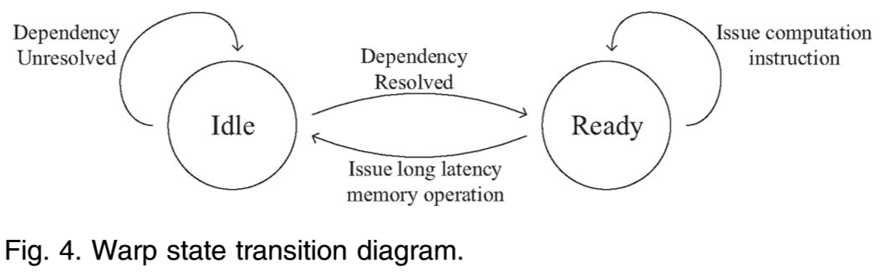

#Kernelet

 *High-Throughput GPU Kernel Executions with Dynamic Slicing and Scheduling*

## Key Points

* propose *Kernelet*
  * a runtime system to improve the throughput of concurrent kernel executions on the GPU. 
  *  for kernel executions, it embraces:
    * **transparent memory management**
    * PCI-e data transfer techniques
    * **dynamic slicing and scheduling techniques**
  * automatically manages the device memory to facilitate sharing GPU among multiple applications 
  * exploits opportunities of overlapping PCI-e data transfer with kernel execution
  * divides a GPU kernel into multiple **sub-kernels (namely slices)**. Each slice has **tunable occupancy** to allow co-scheduling with other slices (heterogeneous workloads)
* develop a novel **Markov chain-based performance model** to guide kernel slicing and scheduling decisions.
* further develop a **greedy algorithm** to always co-schedule slices from the two
  kernels with the highest estimated performance gain
* **Results**: 20%+ performance improvements
* *Kernelet can be extended to multiple GPUs with a workload dispatcher distributing tasks to individual GPUs.*

## Problems & Challenges

* GPUs uses in shared envs, **throughput** is important 

* GPU faces multiple pending kernel launch requests.

  

* most studies focus on single-kernel optimizations

  * the occupancy of kernels is usually high after single-kernel optimizations.

* Recent studies on optimizing concurrent kernels mainly focus on kernels with low GPU occupancy 

* reality: GPU is severely **underutilized**, resulting in suboptimal throughput.

  * due to the inherent memory and computation behavior of a single kernel e.g. 
    * random memory accesses
    * lack of instruction level parallelism

--------

**Formation:**

* A kernel execution can usually be divided into multiple slices, each consisting of multiple thread blocks. 
  * Slices can be viewed as low-occupancy kernels and can be executed simultaneously with slices from other kernels. 
* The GPGPU concurrent kernel scheduling problem is thus converted to the **slice scheduling problem.**

-------

* **Slice Issues:**
  * what is the suitable slice size? How to perform the slicing in a transparent manner? 
    * the smallest granularity: one thread block -> significant runtime overhead of submitting too many such small slices onto the GPU for execution. 
    * the largest granularity: the entire kernel -> degrades to the non-sliced execution. 
  * how to select the slices for co-scheduling.
    * in a complementary way. computation units and memory bandwidth.

## Main Work

### Assumption:

* The kernels are  throughput oriented, with flexibility on the response time for scheduling; no  priori knowledge of the order of the kernel arrival
* Thread blocks in a kernel are independent with each other
* scheduling considers **two kernels only**, more kernel -> NPC problem. slice sizes keep unchanged until either kernel finishes

### Framework

#### Glossary:

* **Kernel state**: 

  

* **Slice:**  a subset of the thread blocks of a launched kernel

  * **Slice size:** # of thread blocks in slice
  * **Slice plan:** a scheme slicing K into a sequence of n slices s0, s1, s2, ..., s_n-1

* **Co-schedule:**   cs defines concurrent execution of n slices

* **Scheduling Plan:**  given n kernels, a scheduling plan C (cs0, cs1,..., cs_n-1) determines a sequence of co-schedules in their order of execution

* **Co-Scheduling Profit**: 

  

  where IPCi and cIPCi are IPC for sequential execution and concurrent execution of kernel i respectively.

* **Problem Definition:** Given a set of kernels for execution, to determine the optimal scheduling plan (and slicing) so that the total execution time for those kernels is minimized.  (*in the shared GPU environment, the arrival of new kernels may trigger re-optimization.* )

#### System Overview:

* **Rationale:** real time, light overhead

  * inspired by the classical multi-level design on process scheduling in operating systems. **decouple** the scheduling decisions into **two independent levels**
    * ***memory command scheduler*** on handling memory management and data transfer commands;  aims at fully utilizing the PCI-e bus bandwidth
    * ***kernel scheduler*** on performing co-scheduling on the ready GPU kernels; aims at fully utilizing the GPU computation resources

* **Overview:**

  

  A kernel is submitted in the form of SASS or PTX code. Once the scheduling plan is obtained, the kernel slicer transforms the kernel code into slices. 

  Then, the slices from the two kernels are co-scheduled and executed on the GPU until either kernel finishes

* **Kernel Slicing:** need to determine the minimum slice size for keeping low slicing overhead, no more than 2%.  

  * propose the index rectification process to ensure the output is exactly the same as the original kernel invocation. The transformation takes the PTX/SASS code of the kernel as input, and does not require the source code

* **Scheduling:** a greedy scheduling algorithm for 2 ready kernels.

  

* **Performance Model:** 

  * for two purposes
    * select the two kernels for co-scheduling
    * determine the slice size
  * **crux:** thread blocks from different kernels have interleaving executions-> non-determinism on the instruction execution flow. not feasible to statically predict the interleaving execution patterns for warps from multiple kernels
  * **assumptions**, and relax those assumptions at the end of this section. 
    * all the memory requests are coalesced. This is the best case for memory performance. 
      * will relax by considering both coalesced and uncoalesced memory accesses.
    * the GPU has a single warp scheduler. 
      * will extend it to the GPU with multiple warp schedulers.
    * assume the GPU adopts a round-robin style warp scheduling policy to minimize block synchronization overhead
  * **Solution: **probabilistic performance model, low runtime overhead, Markov chain theory;
    * use the performance estimation of one SM to represent the aggregate performance of all SMs on the GPU
    * model the process of kernel instruction issue as a stochastic process
    * devise a set of states for an SM during execution.

  

  * **Estimate IPC:** details see the paper pp.6 
    * Use steady state derived by Markov Chain to estimate the IPC of each kernel.

  * **estimate the optimal slice size ratio for two kernels**
    * **target:** *balanced slice ratio:* the slice ratio which minimizes the execution time difference of co-scheduled slices --> maximized kernel-level parallelism
  * **Uncoalesced Memory Access:** use the linear model to estimate the memory operation latency
  * **Multiple Warp Schedulers:** extend our model to handle this case by deriving a single pipeline virtual SM based on the parameters of the SMX.

## Concepts:

* GPU virtualization: rCUDA, V-GPU

* Fermi's cooperative kernel scheduling: Other kernels requesting the GPU must wait until the kernel occupying the GPU voluntarily yields control
* SM occupancy: the ratio of active warps to the maximum active warps that are allowed to run on the SM.
* GPU Code Compilation. In the process of CUDA compilation, the compiler first compiles the CUDA C code to PTX (Parallel Thread Execution) code. PTX is
  a virtual machine assembly language and offers a stable programming model for evolving hardware architectures. PTX code is further compiled to native GPU instructions (SASS). The GPU can only execute SASS code. CUDA executables and libraries usually provide PTX code or SASS code or both. In shared environments, the CUDA C code is usually not available to the system
  back end.
* warps within the same thread block usually have data dependency with each other, e.g., with the usage of shared memory

## Related Work/Paper:

GPU performance model limited to single kernel:

- [ ] An Analytical Model for a GPU Architecture with Memory-Level and Thread-Level Parallelism Awareness
- [ ] A Performance Analysis Framework for Identifying Potential Benefits in GPGPU Applications 📌
- [ ] A Quantitative Performance Analysis Model for GPU Architectures

CPU related:

- [ ] Analysis and Approximation of Optimal Co-Scheduling On Chip Multiprocessors 

   notes: given more than two co-running jobs, finding the optimal scheduling plan is an **NP-complete problem**

- [ ] Symbiotic Job Scheduling for a Simultaneous Multithreaded Processor

CPU performance model

- [ ] A first-order fine-grained multithreaded throughput model

- [ ] Performance estimation in a simultaneous multi-threading processor

- [ ] A model for performance estimation in a multi-streamed superscalar processor

Multi-kernel execution:

- [ ] Efficient Performance Evaluation of Memory Hierarchy for Highly Multithreaded Graphics Processors

- [ ] Fine-Grained Resource Sharing for Concurrent GPGPU Kernels

    to merge two kernels at the source code level

--------

- [ ] GViM: GPU-Accelerated **Virtual Machines**

- [ ] GPU Resource Sharing and Virtualization on High Performance Computing Systems
- [ ] PTask: Operating System Abstractions to Manage GPUs as Compute Devices

----

- [ ] Supporting GPU Sharing in Cloud Environments with a Transparent Runtime **Consolidation** Framework 📌

-------

- [ ] On Improving the Performance of Multi-Threaded CUDA Applications with Concurrent Kernel Execution By Kernel Reordering

    with small # of thread block

- [ ] Efficiently Using a CUDA-Enabled GPU as Shared Resource 📌

    use a persistently running kernel to handle requests from multiple applications

- [ ] Improving GPGPU Concurrency with **Elastic Kernels** 📌

    without computation & memory consideration 

- [ ] RGEM: A Responsive GPGPU Execution Model for Runtime Engines

    manage the GPU at the operating system level

- [ ] Automatic CPU-GPU Communication Management and Optimization