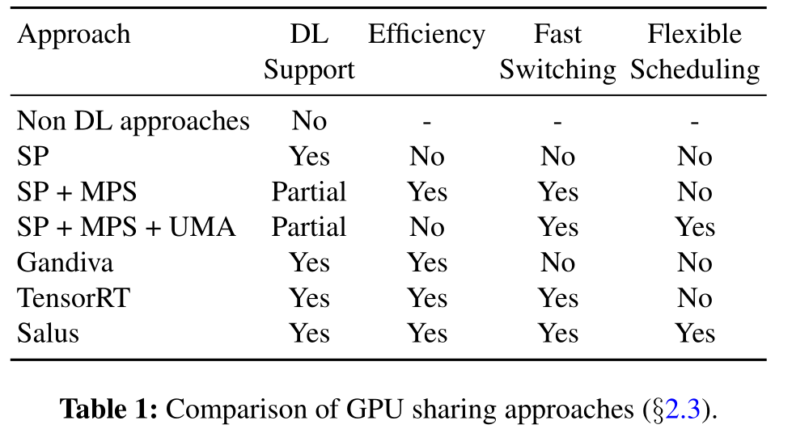
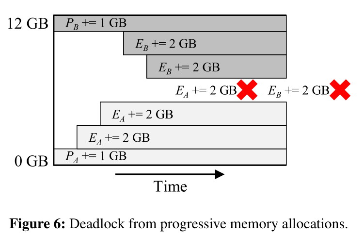
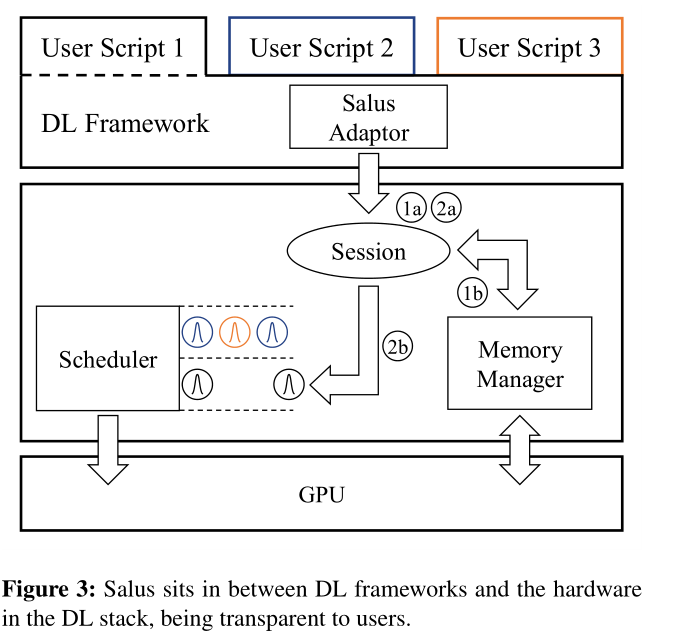
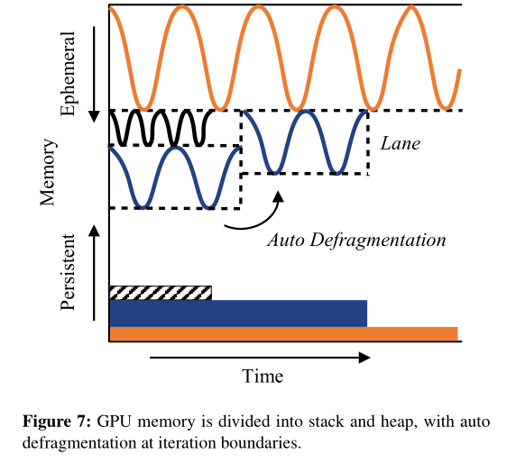
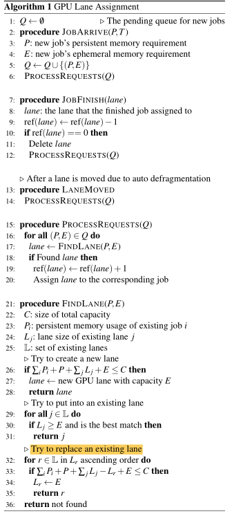
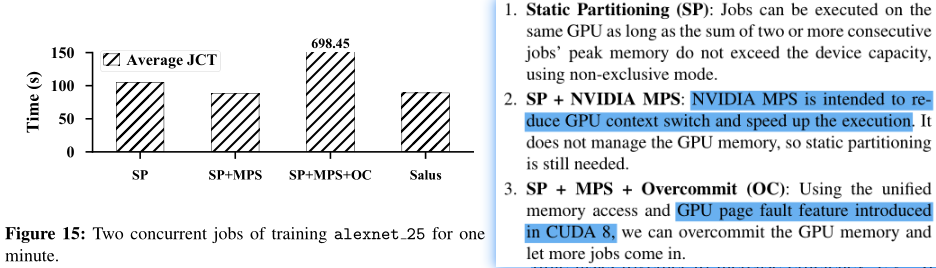

# Salus

Salus: Fine-Grained GPU Sharing Primitives for Deep Learning Applications

https://github.com/SymbioticLab/Salus

## Key Points:

* Salus to enable enable fine-grained sharing of individual GPUs with flexible scheduling policies among co-existing

## Problems:

* the minimum granularity of GPU allocation today is always the entire GPU
* not all DL jobs can fully utilize a GPU all the time

**Kernel Level Scheduling:**

* it may be possible to further utilize GPU resources. However, finer-grained scheduling also adds more overhead to the execution service. 

* Memory Deadlock issue: 

  

## Main Work:

Salus addresses both temporal and spatial aspects of the memory management problem by enabling two GPU sharing primitives:

* Fine-grained time sharing via ***efficient job switching*** among ongoing DL jobs

  * Transferring GPU memory back and forth is not practical to achieve low latency given current GPU communication bandwidth.

    * checkpointing can result in large data transfers from and to the GPU memory

  * There is significantly less persistent memory usage than ephemeral memory for a DL job. It is possible to keep more than one job’s persistent memory in GPU while still having enough space for either one’s ephemeral memory.

    ------

    Memory characteristics:

    * Model: model parameters, persistent
    * Ephemeral: scratch memory needed during each iteration. eg. intermediate layers’ outputs
    * Framework-internal: DL framework book-keeping or for data preparation pipeline, persist

  that fast job switching can **be enabled** by not removing persistent memory from GPU at all

* Dynamic memory sharing via the ***GPU lane abstraction***: 

  * divide GPU memory space into ephemeral and persistent **regions**, growing from both end of the memory space.
  * ephemeral region is further divided into **lanes**

  

  **Lane Assignment:**

  

**Evaluation:**

## Concepts:

**Sharing GPUs**

* [ ] MPS
* [ ] UMA
* [ ] NVIDIA’s TensorRT
* [ ] GPUs provided program controlable fast paging mechanisms, which unfortunately is not the case today.

GPU virtualization:

* [ ] gVirtuS, GViM, vCUDA, rCUDA
* [ ] nvidia-docker:  makes using one NVIDIA GPU in multiple containers possible, but it is essentially the same as removing exclusive-mode on GPU, MPS not well supported

## Related Work/ Paper

* Gandiva
* Optimus

fine-grained GPU sharing：

* intercept GPU calls: dynamically introduce concurrency by time-slicing kernel execution at runtime
  * Improving GPGPU concurrency with **elastic kernels**
  * Chimera: Collaborative preemption for multitasking on a shared GPU
  * Supporting GPU sharing in cloud environments with a transparent runtime consolidation framework
*  call for new APIs for GPU programming:
  * Towards multi-tenant GPGPU: Event-driven programming model for system-wide scheduling on shared GPUs
  * Pagoda: Fine-grained GPU resource virtualization for narrow tasks
  * G-NET: Effective GPU Sharing in NFV Systems
  * Design and Evaluation of the **Gemtc** Framework for GPU enabled Many-task Computing

DL Model serving:

* NVIDIA’s TensorRT
* Clipper