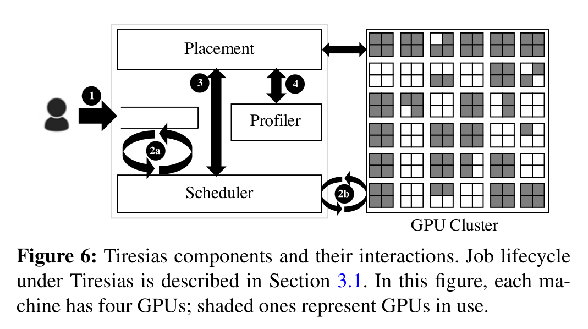
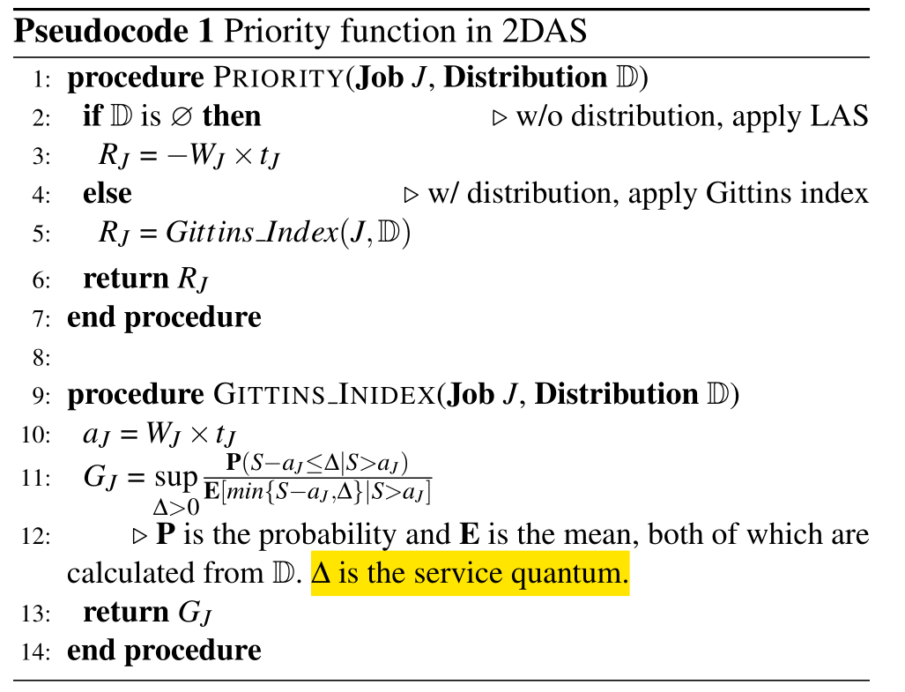
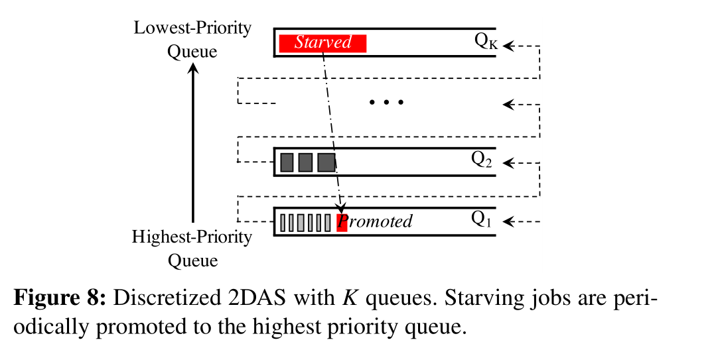
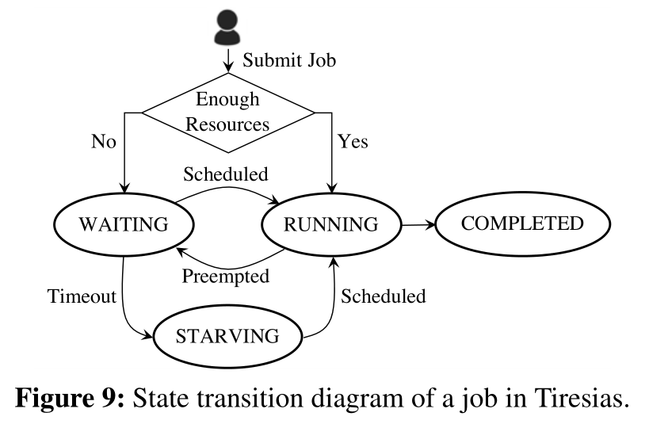
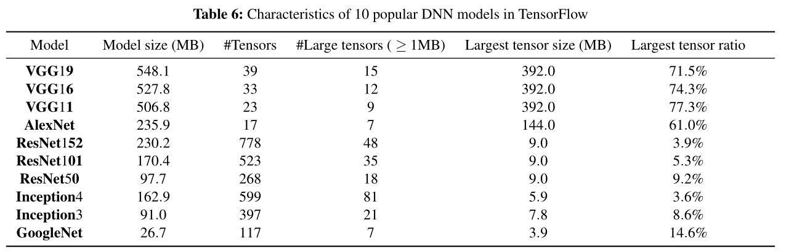
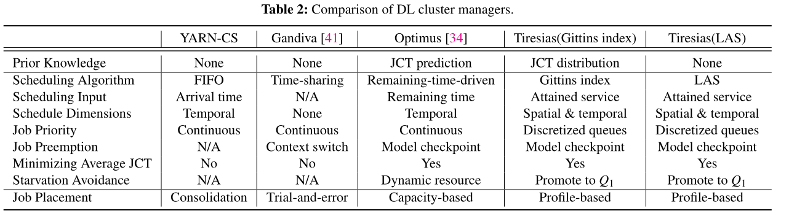

# Tiresias

*Tiresias: A GPU Cluster Manager for Distributed Deep Learning*

propose two scheduling algorithms:

* Discretized Two-Dimensional Gittins index relies on partial information 
* Discretized Two-Dimensional LAS: information-agnostic

aim to minimize the average JCT;  5.5× over an Apache YARN-based resource manager used in production.

-------

## Problem:

1. Naive scheduling due to unpredictable training time: YARN Capacity Scheduler
2. Over-aggressive consolidation during placement

**Challenge:**

* consider both the spatial (how many GPUs) and temporal (for how long) dimensions of a job when calculating its priorities

----

**Challenges for DL Job**

* Unpredictable job duration
* Over-aggressive job consolidation
* Time overhead of preemption

-------

Potential for Benefits:

* jobs cannot be scheduled well without exact job duration
* DDL jobs should always be consolidated

## Design:

As soon as a job is submitted, its GPU requirements become known, and it is appended to a W AIT Q UEUE ( 1 ). The scheduler (§3.2) periodically schedules jobs from the W AIT Q UEUE and preempts running jobs from the cluster to the W AIT -
Q UEUE ( 2a and 2b ) on events such as job arrival, job completion, and changes in resource availability. When starting a job for the first time or resuming a previously preempted job, the scheduler relies on the placement module (§3.3) to allocate its GPUs ( 3 ). If a job is starting for the first time, the placement module first profiles it – the profiler identifies job-specific characteristics such as skew in tensor distribution to determine whether to consolidate the job or not ( 4 ).

**Objective:**

* Minimizing the average JCT
* High GPU utilization
* Starvation freedom

**S.T.**

* Online job arrival:  Tiresias only deals with resource allocation and scheduling
* Unknown job durations
* Unknown job-specific characteristics
* All-or-nothing resource allocation: DL training jobs require all parameter servers and workers to be simultaneously active; i.e., all required resources must be allocated together.

### Two-Dimensional Scheduling

shortest-remaining-service-first (SRSF): ideal model with the knowledge of resource config & duration.

**2DAS Two-Dimensional Attained Service-Based Scheduler**

* schedules DL jobs without relying on their exact durations while taking their GPU requirements into consideration

  2DAS assigns each job a priority based on its attained service. The attained
  service of a job is calculated based on the **number of GPUs it uses (WJ )** and the **amount of time it has been running so far ($t_J$)**

  

  All jobs start with the highest priority, and their priorities decrease as they receive more service

  **2 Approaches for priority**

  * classic least-attained service(LAS) scheduling discipline:
    * no job duration information
    * prefers jobs that received less service
  * the Gittins index policy
    * provides the distribution of job duration from previous experience
    * represent  how likely the job that has received some amount of service can complete within the next service quantum
    * the ratio is between 
      * (1) the probability that the job will complete within the service quantum of ∆ (i.e., the possibility of reward when adding up to ∆ overhead on all subsequent jobs) 
      * (2) the expected service that Job J will require for completion.

**Priority Discretization**

problem:  *continuous priorities can lead to a sequence of preemptions and subsequent resumptions for all jobs.*

solution: adopting the priority discretization framework based on the classic **Multi-Level Feedback Queue (MLFQ)** algorithm

The i-th queue contains jobs of attained service ($W_Jt_J$) values within $[Q_i^{lo},Q_i^{hi})$. $Q_1^{lo}=0$, $Q_K^{hi}=\infin $

* LAS: same queue are scheduled in a FIFO order of their start time

* Gittins: For jobs in Qi , ∆i equals $Q^{hi}_i$ which is the upper limit of Qi,  jobs in the same queue are scheduled according to their Gittins index values

**Determining K and queue thresholds**: open problem. K=2 is okay

**Avoiding starvation**: 

* promote a job to the highest priority Q 1 if it has been WAITING for longer than a threshold: STARVELIMIT;
* provide a single knob (PROMOTEKNOB ) for the cluster operator to promote a job if its WAITING time so far (δ J ) is PROMOTEKNOB times larger than its execution time so far (t J ).
* both t J and δ J are reset to zero to ensure that a promoted job is not demoted right away.

### Placement:  which jobs benefit from consolidation? 

**skew of the model structure** (S J ) can be a good predictor.

The DL models whose performance are sensitive to consolidated placement  have huge tensor(s); their largest tensor size dominates the whole model.

Each tensor is wrapped as a single communication message. aggregating larger tensors suffers from network contention more severely, while transmissions of smaller tensors tend to interleave better with each other.

**Profiler**: identifies the amount of skew in tensor distributions across parameter servers (SJ) without user input and in a framework-agnostic manner. 

To automatically identify the skew via profiling:

* observing DDL network communications can inform us of the skew. 
* intercepts communication APIs – including the low-level networking APIs like RDMA ibverbs – in each machine to collect process-level communication traces
* also enables us to identify a job’s iteration boundaries, model size, and skew characteristics.

**Placement algorithm**: compares SJ with a threshold (PACKLIMIT); if SJ is larger than PACKLIMIT, Tiresias attempts to consolidate the job in as few machines as possible.

For **PACKLIMIT**: rely on **job history** to periodically update PACKLIMIT. Currently, we use a **simple linear classifier** to periodically determine the PACKLIMIT value using **a job’s placement and corresponding performance** as features.

### Implementation:

Tiresias as a centralized resource manager:

Tiresias makes job placement decisions based on profiling via a **network monitoring library**. This library is present in every server of the cluster and communicates with the central profiler so that Tiresias can determine the skew of each new DDL job.

----

